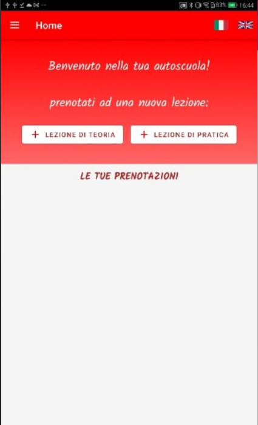
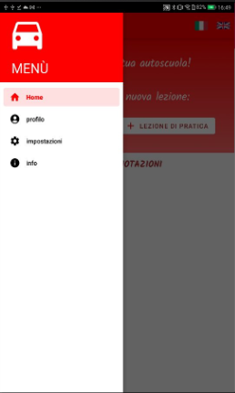
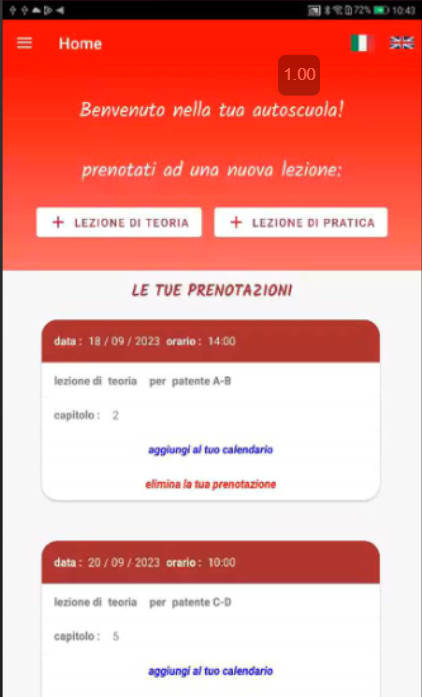

# AutoScuola - Android App 🚗📱

Welcome to the **AutoScuola** app repository! This application simulates the services provided by an Italian driving school, allowing users to book both theory and practice driving lessons. The app uses Firebase for authentication and provides a user-friendly interface for managing lesson bookings.

## 🛠️ Features

The app includes the following features:  
- **Firebase Authentication:** Users can register and log in securely using Firebase.  
- **Home Screen:** After logging in, users are directed to the home screen where they can easily access all app features.  
- **Lesson Booking:** Users can view a list of available lessons (both theory and practice) and book them.  
- **Notifications:** Once a lesson is booked, the app sends a notification to remind users of their upcoming lesson.  
- **Google Calendar Integration:** Users are offered the option to add their booked lessons to Google Calendar.  
- **Booked Lessons Display:** The lessons the user has booked will be visible on the home screen for easy reference.  
- **Settings and Profile Management:** Users can personalize their profile and configure app settings through the menu.  

## 🎮 How to Use

1. Open the app and log in or register using Firebase Authentication.  
2. Once logged in, you will be directed to the home screen.  
3. From the home screen, you can view available lessons and book a spot for theory or practice sessions.  
4. After booking, you will receive a notification about your lesson. You can also choose to add the lesson to your Google Calendar.  
5. The booked lessons will appear on the home screen for easy tracking.  
6. Use the menu to access settings and manage your profile information.  

## 📁 Project Structure

The project is organized as follows:  
- **.idea:** Contains project-specific configuration files for Android Studio.  
- **gradle:** Contains the Gradle wrapper files for managing dependencies and building the project.  
- **app:** Contains the main application code and resources. Inside the `app` folder:  
  - **src/main/java/com/example/scuolaguida:** Contains the Java code for the activities, logic for Firebase authentication, and lesson booking functionality.  
  - **src/main/res:** Contains all XML layout files for the user interface and all the resource files like strings, colors, and styles.
  - **src/main/AndroidManifest.xml:** The manifest file that defines the app components.

## 🚀 Technologies Used

- **Android Studio:** The development environment used to create the app.  
- **Firebase Authentication:** For user authentication and management.  
- **Google Calendar API:** To integrate the app with Google Calendar for lesson bookings.  

## 🖥️ Requirements

- Android device or emulator running Android 5.0 (Lollipop) or higher.  
- **Firebase** project setup for authentication and push notifications.  

  
  
  

